# Plotting

RobStatTM-Py ships a native Python plotting suite, `robstattm_py.plot`, for
publication-quality, fully customizable robust-statistics figures, plus a
pixel-faithful **R graphics** path for when you want exactly what the textbook
prints.

```python
import robstattm_py as rpm
from robstattm_py import plot

mineral = rpm.datasets.mineral()
fit = rpm.lmrobdet_mm("zinc ~ copper", data=mineral)

ax  = plot.residuals(fit)                    # native matplotlib Axes (default)
ax  = plot.residuals(fit, backend="r")       # R's own graphics → PNG path
fig = fit.plot_diagnostics()                  # shortcut on the result object
```

> **Install:** the native engine needs the optional plotting extra,
> `pip install "./robstattm-py[plots]"` from a clone (matplotlib; plotnine is
> optional). Once the package is on PyPI this becomes
> `pip install "robstattm-py[plots]"`. The `backend="r"` path needs a working R
> bridge.

## Backends

Every plot function takes `backend=`:

| `backend` | Engine | Returns | Notes |
|---|---|---|---|
| `"auto"` *(default)* | native matplotlib, else R | `Axes`/`Figure`/`Path` | falls back gracefully |
| `"native"` / `"matplotlib"` | matplotlib | `Axes` / `Figure` | composable, themable |
| `"plotnine"` | plotnine | `ggplot` | all plot families (grammar of graphics) |
| `"r"` | R graphics (Path A) | `pathlib.Path` (PNG) | bit-faithful to the book |

Native plots **never re-fit**, they read the arrays already on the (strict-tier
validated) result objects. `backend="r"` re-fits in R and is the fidelity
reference. Every plot function also has a **plotnine** (`ggplot`) renderer for
grammar-of-graphics users, `plot.<fn>(..., backend="plotnine")`. The whole suite is composable: pass `ax=`, build subplot grids, and
nothing calls `plt.show()` unless you ask (`show=True`).

## Native vs R, side by side

The native renderer reproduces the textbook diagnostics while adding robust-weight
colouring and automatic outlier labelling; `backend="r"` gives the exact R panel.

`````{tab-set}
````{tab-item} Native (matplotlib)
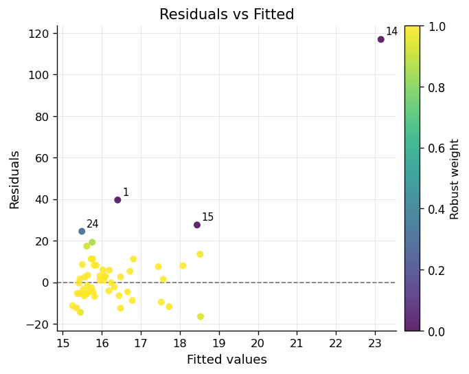
````
````{tab-item} R graphics (backend="r")
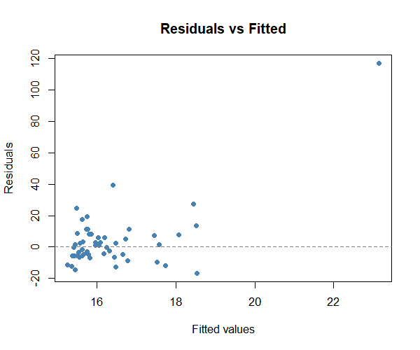
````
`````

The full 2×2 diagnostic panel:

`````{tab-set}
````{tab-item} Native
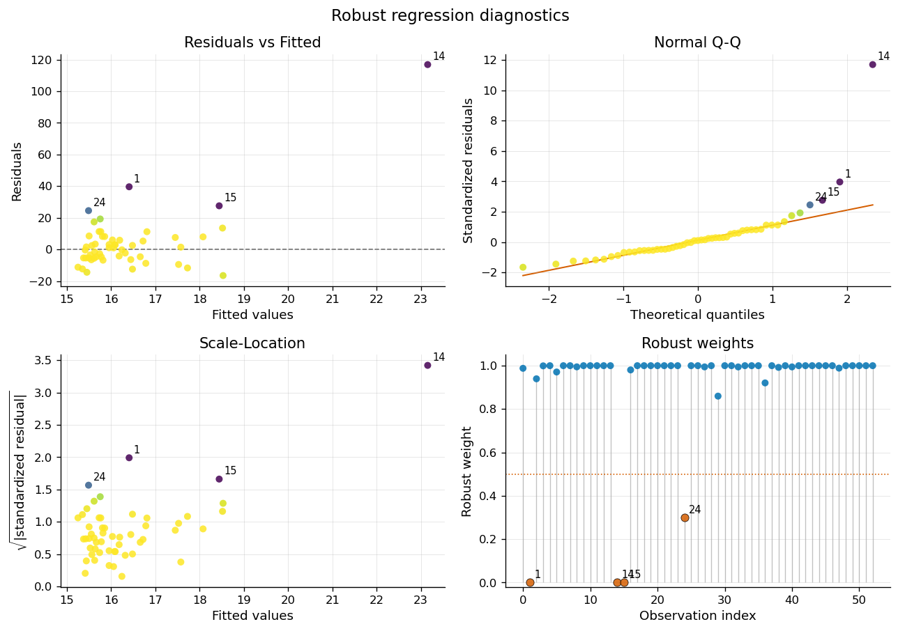
````
````{tab-item} R graphics
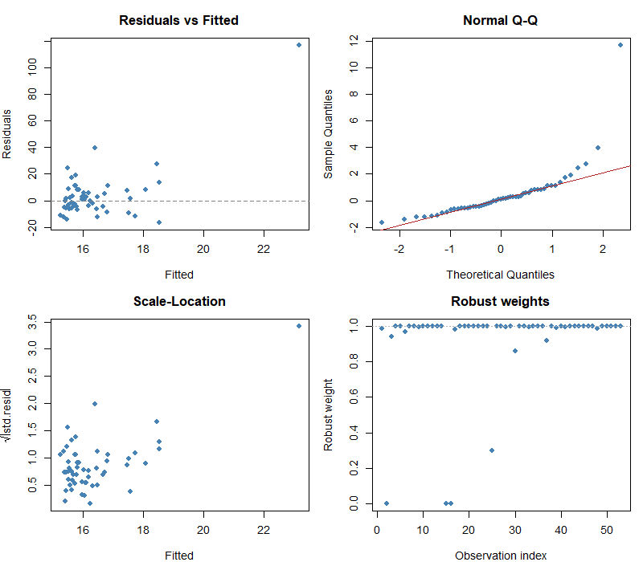
````
`````

## Themes & customization

`rpm.plot.set_theme(...)` sets a global look; per-call keywords override it, and a
`PlotStyle` instance gives full control.

```python
plot.set_theme("publication")                      # default
plot.set_theme("book", font_scale=1.1)             # named + override
style = plot.PlotStyle(weight_cmap="magma", point_size=50, grid=False)
plot.residuals(fit, style=style, highlight=[14, 1], labels=mineral.index.astype(str))
```

The four built-in themes (`publication`, `book`, `minimal`, `dark`):

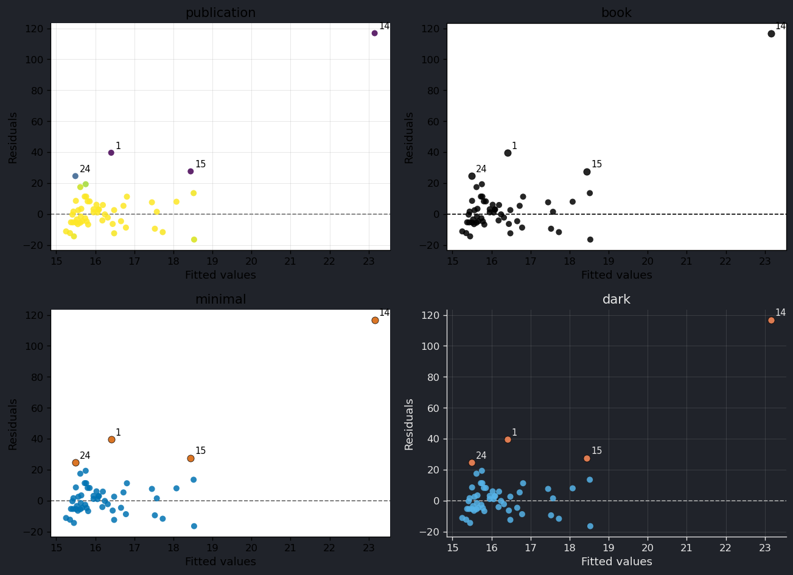

Common keywords on every function: `backend`, `ax`/`fig`, `style`, `highlight`
(indices to label), `labels` (point labels), `annotate` (force on/off),
`title`, `save` (write a file), `show`, plus any `PlotStyle` field as a keyword
(e.g. `point_size=`, `weight_cmap=`, `color_by_weight=`).

## Regression diagnostics

```python
plot.residuals(fit)            # residuals vs fitted, coloured by robust weight
plot.qq(fit)                   # normal Q-Q of standardized residuals
plot.scale_location(fit)       # sqrt(|std resid|) vs fitted
plot.weights(fit)              # robust weight vs index, with cutoff
plot.diagnostics(fit)          # the 2×2 panel above
```

Scatter with the robust fitted line (and optional OLS for contrast), and a
multi-estimator comparison:

```python
plot.scatter_with_fit(fit, show_ols=True)

dcml_fit = rpm.lmrobdet_dcml("zinc ~ copper", data=mineral)
plot.compare_fits({"MM": fit, "DCML": dcml_fit})
```

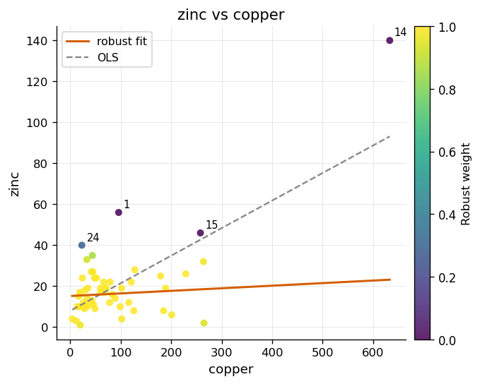

## Multivariate (robust covariance & PCA)

The **distance–distance** plot contrasts robust vs classical Mahalanobis
distances, robust estimation unmasks the outliers the classical fit hides
(wine data: points above the χ² cutoff):

```python
rpm.set_seed(42)
rob = rpm.cov_rob_mm(rpm.datasets.wine())
cl  = rpm.cov_classic(rpm.datasets.wine())
plot.distance_distance(rob, cl)
plot.mahalanobis_panel(rob)            # distances vs index, χ² cutoff
```

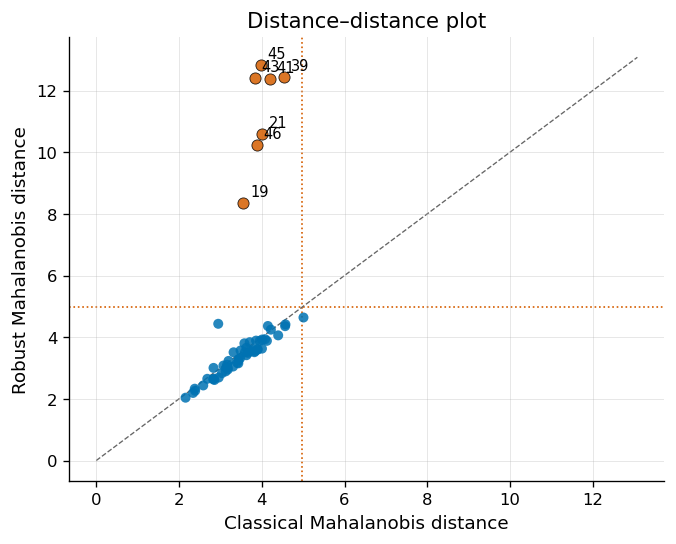

Robust PCA, scree, scores (flag outliers via companion robust distances),
loadings heatmap, and biplot:

```python
pr = rpm.prcomp_rob(rpm.datasets.wine())
plot.scree(pr)
plot.scores(pr, distances=rob.dist)
plot.loadings(pr, ncomp=5)
plot.biplot(pr)
```

`````{tab-set}
````{tab-item} Scree
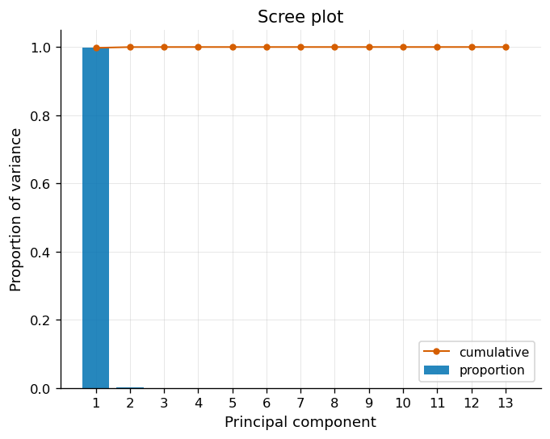
````
````{tab-item} Scores
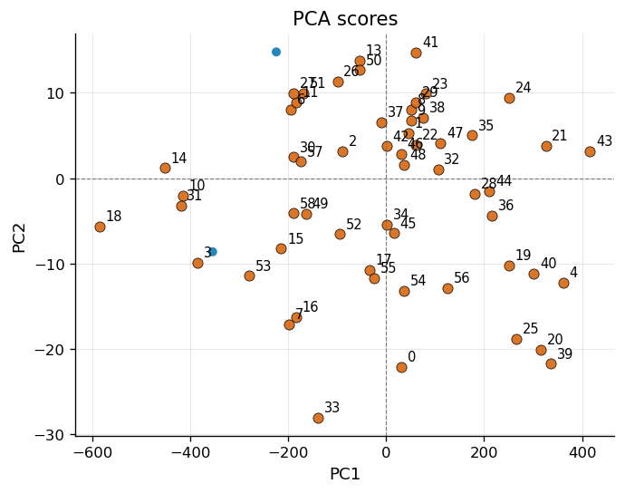
````
````{tab-item} Loadings
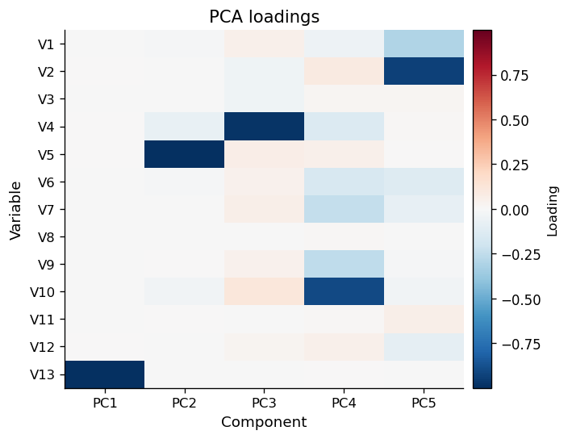
````
````{tab-item} Biplot
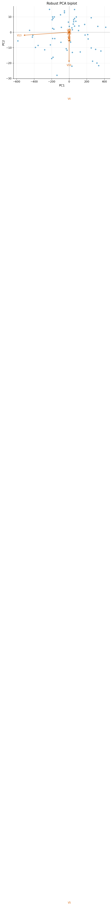
````
`````

## Univariate (robust location & scale)

```python
col = rpm.datasets.flour().iloc[:, 0].to_numpy()
ls  = rpm.loc_scale_m(col)
plot.location_scale(ls, col)           # robust μ ± disp vs classical mean ± sd
```

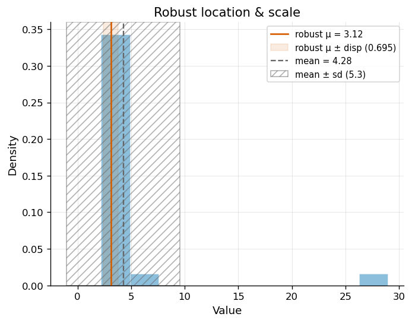

## New analytical views

Beyond reproducing the textbook figures, the suite includes analytical plots for
working with the data directly in Python:

`````{tab-set}
````{tab-item} Residual vs leverage
Robust influence diagnostic, standardized residual against hat-value leverage.

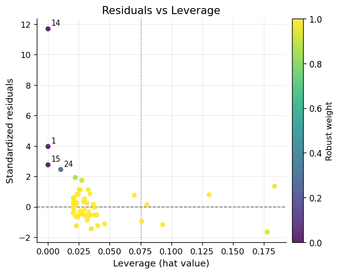
````
````{tab-item} Δ correlation heatmap
How outliers distort the classical correlation structure: `corr(robust) − corr(classical)`.

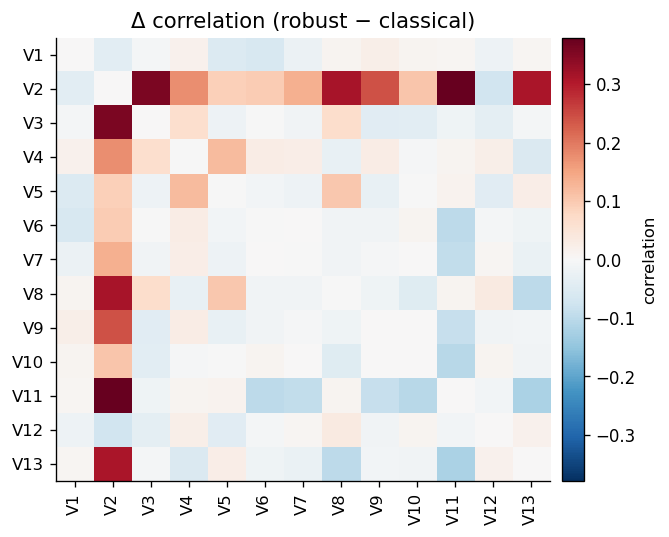
````
`````

```python
plot.resid_vs_leverage(fit)            # needs leverage → fit.hatvalues()
plot.cov_heatmap(rob, cl)              # robust − classical correlation delta
```

## API summary

| Function | Input | Reproduces / use |
|---|---|---|
| `residuals` / `qq` / `scale_location` / `weights` / `diagnostics` | regression fit | Figs 5.2/5.3/5.5/5.6 |
| `scatter_with_fit` / `compare_fits` | regression fit(s) | Figs 5.1/5.4/5.7 |
| `resid_vs_leverage` | regression fit | influence (new) |
| `distance_distance` / `mahalanobis_panel` | robust + classical `cov_*` | Fig 6.3, outlier detection |
| `scree` / `scores` / `loadings` / `biplot` | `pca_rob_s` / `prcomp_rob` | Fig 6.10, PCA |
| `cov_heatmap` | `cov_*` (+ optional second) | correlation structure (new) |
| `location_scale` | `loc_scale_m` + sample | Ch 2 location/scale |
| `set_theme` / `get_theme` / `PlotStyle` |, | theming |

> **Regenerating the gallery images:** the figures on this page are produced by
> `docs/scripts/render_plots.py` (needs R + the `[plots]` extra). The Sphinx
> build itself stays R-free.
